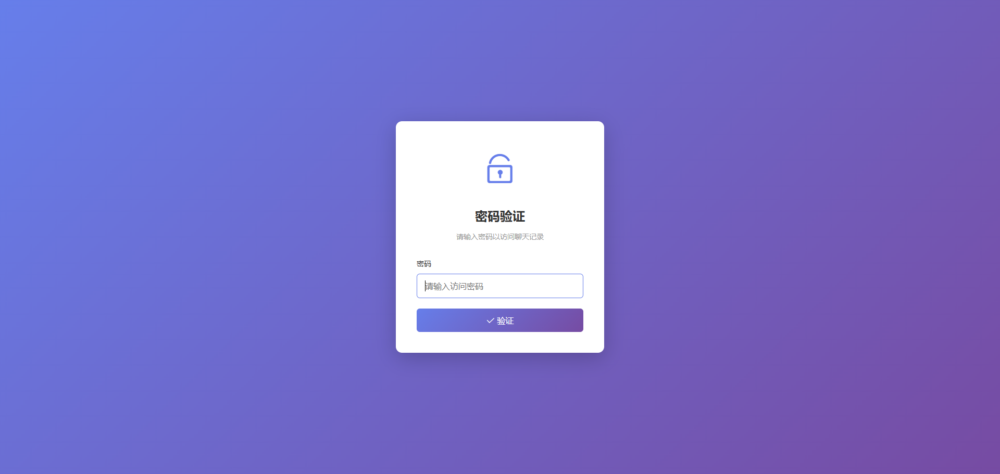
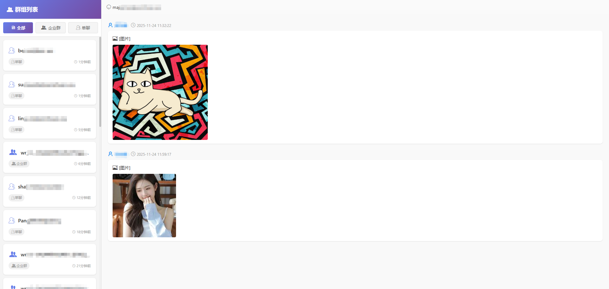
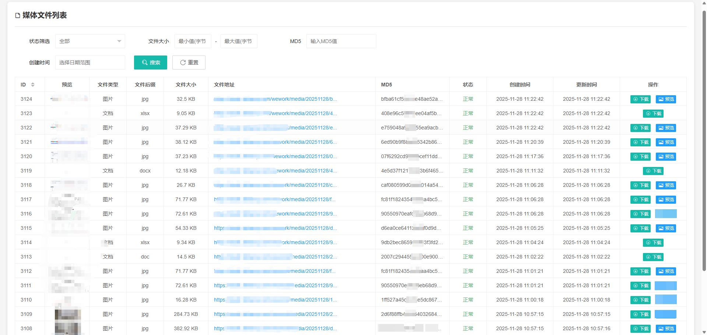

# 企业微信聊天记录(图形化)

* 聊天记录自动拉取
* 聊天记录图片自动下载并保存至【阿里云OSS、腾讯云COS、七牛云】云存储
* 聊天记录自动分析聊天到群组
* 聊天记录展示功能
* 数据同步、异步分析
* 多组织企业微信
* 自动匹配企业员工名称【开发ing】
* 自动匹配企业客户名称【开发ing】
* 与其他CRM项目自动挂载数据【开发ing】

## 截图




## 软件架构
* 使用语言 PHP 8.2
* 基于 Laravel 8.7 框架
* 项目基于 [tinymeng/wework-finance-sdk](https://github.com/majiameng/wework-finance-sdk-php)  扩展

## 环境要求
- 独立服务器
- CentOS 7.0+ 或 Ubuntu 20.04+
- PHP 7.3+
- MySQL 5.7+
- Apache httpd 2.4+ 或者 Nginx 1.10+

### 相关开源
- [wework-chat-history](https://github.com/majiameng/wework-chat-history)	(php版，含数据入库，图形化)
- [wework-msgaudit](https://github.com/majiameng/wework-msgaudit)	(Java版，含数据入库，无图形化)


## 企微聊天获取服务
```
# 守护进程模式运行
php artisan wework --daemon

# 或者使用简写
php artisan wework -d

# 自定义间隔时间
php artisan wework --daemon --interval=30

# 单次执行（不带 --daemon）
php artisan wework

# 在另一个终端停止服务
php artisan wework --stop
```

异步队列服务
```
php artisan queue:work
# 守护进程模式运行
php artisan queue:work -d	
```

聊天记录表定期备份服务
```
# 正常执行（只在1号执行）
php artisan MessageOriginalTableRotate

# 强制执行（忽略日期检查，用于测试）
php artisan MessageOriginalTableRotate --force
```

聊天记录访问：
```
http://127.0.0.1:8080/chat
密码： 123456
密码修改.env文件里的CHAT_PASSWORD
```


合作联系：

